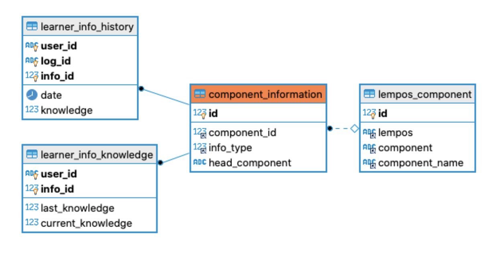

# Item Recommendation

We use item recommendation system in Elia real-time to determine which target words have the priority to be used in
exercises. We have 16k target works a.k.a lemposes in Elia (lempos = lemma + pos, e.g. work_NOUN). However, in any moment some of the words 
will have higher probability to be forgotten by the users. Therefore, the lemposes to be practiced by the users in exercises have a probability of forgetting 
value calculated by a machine learning model (this model has already been trained). The goal of this task is to create a code which would integrate this ML algorithm with our systems of databases. The integration pipeline should 1) retrieve users' data with the lemposes (words) from a table that would serve as an input to the trained ML model, 2) run the model to calculate the probability of forgetting and 3) store this output in a user table. It should be run for each user and each lempos(words) that they have seen. This is a real-time process which is repeated on regular basis (we might have 50 such instances in one second). Hence, it should be optimised as much as possible. 

## Existing ML Model: Half-life regression

The model is defined [here](https://research.duolingo.com/papers/settles.acl16.pdf). It creates a feature vector for each user
to obtain half-life and the probability of recall for the given word. For example, if the half-time is 2 days, 2 days after the user
is practiced the word, the user has 0.5 chance to recall the word, in other words 1-0.5=0.5 is the probability of forgetting the word. 
Therefore, with the help of this method, a function will produce a probability of forgetting for each word practiced by the users. 
The words will be sorted with respect to the probabilities in descending order to create exercises. 

### Feature Vector

    lexeme_id: lempos (e.g. work_NOUN)
    timestamp: int --- Last time practiced 
    user_id: str 
    history_seen: --- total no of times user see the word 
    history_correct: --- total no of times user was right 
    wrong: int 
    session_correct: int
    session_seen: int
    
Please refer to duolingo_spaced_algo.py and [paper](https://research.duolingo.com/papers/settles.acl16.pdf) for detailed explanation
of features.

### Update for each user (with old DB Architecture)

  
  
User Interaction and Knowledge Tables

Inputs to Algorithm:

    all rows of learner_info_history table including given user_id: log_id, info_id, date, knowledge
    
    log_id: unique id of sessions
    info_id: unique id of the information practiced (translation, synonym, form, etc of information of the lempos)
    date: datetime 
    knowledge: int enumerated as
    [ACT : 1, NRCG: 2, NTC :3, RCG: 4, NRCL: 5, PRCL: 6, RCL: 7]
    
    NRCL, NRCG -> incorrect answers
    RCG, PRCL, RCL -> correct answers
    NTC, ACT -> neither correct nor incorrect, it should be counted to the times that word is seen. 
    
##### Steps:
    1: Group by log_id to determine the sessions.
    2: Compute correct and incorrect answers for each session (NRL, NRCG-> incorrect - PRCL, RCL, RCG->correct).
    3: Compute total incorrect and correct answers for each row (NRL, NRCG-> incorrect - PRCL, RCL, RCG->correct).
    4: Join with component_information and lempos_component table to obtain lemposes.
    5. Group by lemposes to obtain latest date practiced.
    6. Compose feature vector for Spacing Algorithm.
    7: Retrive previous half-life.
    8. Update half-life and forgetting probability with Spacing method with new feature vector.

### Update for each user (new DB Architecture)

Instead of repeating the same computation to obtain the correct and incorrect answers for each lempos, 
create learner_component_history and learner_lempos_history to count correct and incorrect answers and
store the last date. 
